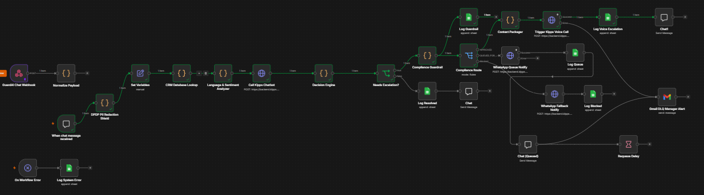

<div align="center">

<!-- KIPPS.AI & TECH STACK BADGES -->


<br/><br/>

<!-- OFFICIAL LOGO -->
<!-- ⚠️ REPLACE THIS SRC WITH YOUR ACTUAL LOGO PATH ⚠️ -->


# GuardAI
### The Decision & Compliance Guardrail for Autonomous Chat-to-Voice Escalation

**Built for Kipps.AI Developer Hackathon 2026 · Track 03: Support (Resolve, Escalate Wisely)**

<br/>

*Most AI agents are chatbots with better branding. GuardAI is the enterprise brain that decides which Kipps.AI agent speaks, when they speak, and whether it is legally compliant to do so.*

<br/>

<!-- ⚠️ LIVE DEMO VIDEO PLACEHOLDER ⚠️ -->
<a href="YOUR_YOUTUBE_LINK_HERE">
  
</a>
<br/>*(System in action: Kipps Chat → PII Redaction → Decision Engine → TRAI Guardrail → Kipps Voice Escalation)*<br/>

<br/>

<a href="#overview"><kbd> &ensp; Overview &ensp; </kbd></a>&ensp;
<a href="#problem"><kbd> &ensp; The Gap &ensp; </kbd></a>&ensp;
<a href="#roi"><kbd> &ensp; ROI & Impact &ensp; </kbd></a>&ensp;
<a href="#architecture"><kbd> &ensp; Architecture & Workflow &ensp; </kbd></a>&ensp;
<a href="#nodes"><kbd> &ensp; Node Breakdown &ensp; </kbd></a>&ensp;
<a href="#screenshots"><kbd> &ensp; Kipps Integration Proofs &ensp; </kbd></a>&ensp;
<a href="#qa"><kbd> &ensp; Platform Auditing & QA &ensp; </kbd></a>

</div>

---

<div id="overview"></div>

## 📜 Overview

In dual-channel automated support, the failure mode is twofold: **Under-escalation** leaves customers stuck in endless chat loops, while **Over-escalation** blindly triggers costly voice calls for every unresolved query. 

GuardAI sits securely between the customer and **Kipps.AI's native agents**. It acts as a strict enterprise judgment layer that evaluates sentiment, parses urgency, checks regulatory telecom compliance, and orchestrates the handoff from the Kipps Chatbot directly to the Kipps Voicebot dynamically via the `/speech/phone-call/` REST API.

> **The Real Ask:** *"It isn't 'connect chat to voice.' It's 'know when NOT to.' "*

---

<div id="problem"></div>

## ⚠️ The Enterprise Gap (Regulatory Exposure)

At 50,000 queries a day, automated escalation means automated outbound voice contact at scale. Without a guardrail, this brings massive regulatory exposure in the Indian telecom sector. 

GuardAI introduces a **Compliance-by-Design** architecture to make Kipps.AI deployments Fortune 500-ready:
* **TRAI DND Enforcement:** Governs unsolicited automated calls based on time-of-day regulations. Prevents the AI from waking customers up at 2:00 AM.
* **Frequency Capping:** Evaluates a per-customer ledger before outbound Kipps triggers fire to prevent spam and telecom blacklisting.
* **DPDP Act (Data Privacy):** Strips PII (Personally Identifiable Information) from the chat context *before* briefing the downstream Voice Agent to prevent data leakage.

---

<div id="roi"></div>

## 📈 Platform ROI & Efficiency

* **Optimized API Spend:** By filtering out low-priority escalations and routing them to WhatsApp fallbacks, GuardAI preserves Kipps telecom credits and SIP routing bandwidth exclusively for critical customer interventions.
* **Seamless Handoffs:** The Kipps Voice Agent starts the call fully briefed ("I see your account was hacked..."), eliminating the highest friction point in customer service: repeating information.
* **Zero Compliance Fines:** Strict adherence to Indian TRAI quiet-hours completely eliminates the risk of regulatory penalties for unsolicited automated dialing.

---

<div id="architecture"></div>

## 🏗️ System Architecture Flow

GuardAI is engineered like production software featuring reliability, fault tolerance, dead-letter queues, and stateless observability.

```mermaid
graph TD
    classDef input fill:#1e3a8a,stroke:#60a5fa,color:#fff;
    classDef decision fill:#ea580c,stroke:#fb923c,color:#fff;
    classDef compliance fill:#7f1d1d,stroke:#f87171,color:#fff;
    classDef execution fill:#065f46,stroke:#34d399,color:#fff;
    classDef observe fill:#4c1d95,stroke:#a78bfa,color:#fff;

    A[Incoming Customer Query]:::input --> B[Kipps Chat Agent]:::input
    B --> C{Resolution Classifier}:::decision
    
    C -->|Resolved| D[Log to Observable DB]:::observe
    C -->|Needs Escalation| E{Escalation Decision Engine}:::decision
    
    E -->|Urgent & Frustrated| F{TRAI / DND Guardrail}:::compliance
    
    F -->|Blocked / Quiet Hours| G[Queue for Morning & WhatsApp Notify]:::execution
    F -->|Approved| H[Kipps Context Packager]:::execution
    
    H --> I[Trigger Kipps Voice API /speech/phone-call/]:::execution
    I --> J[Live AWS TTS / Deepgram STT Call Initiated]:::execution
    
    G --> K[(Google Sheets Audit Log)]:::observe
    J --> K
````

---

## ⚙️ The n8n Workflow (Node-by-Node Breakdown)

<div align="center">
  
  <br/><em>The complete GuardAI orchestration layer mapping chat ingestion, compliance routing, and voice fallback.</em><br/><br/>
</div>

The entire orchestration layer was built using **n8n** to ensure visual observability and rapid iteration. Below is the exact execution path of a single customer interaction.

### Phase 1: Ingestion & Security

* **`GuardAI Chat Webhook`**: The entry point. Listens for incoming POST requests from the customer-facing chat UI.
* **`Normalize Payload`**: Standardizes the incoming JSON structure to ensure downstream nodes don't break on malformed data.
* **`DPDP PII Redaction Shield`**: A critical security node. Uses Regex-based AI filtering to scrub credit card numbers, exact addresses, and passwords from the chat *before* it is ever sent to the Kipps API.

### Phase 2: Context & Analysis

* **`Set Variables (manual)`**: Binds the active `VOICEBOT_ID`, `KIPPS_ORG_ID`, and user E.164 phone credentials dynamically to prevent hardcoded scope leaks in the API headers.
* **`CRM Database Lookup`**: Simulates a database fetch to retrieve the user's VIP status, historical contact frequency, and opt-out preferences.
* **`Language & Sentiment Analyzer`**: Evaluates the user's input to detect frustration levels (0-100) and the primary language (English, Hindi, Gujarati, etc).
* **`Call Kipps Chatbot`**: Dispatches the sanitized query to the primary Kipps Chat Agent to attempt a Tier-1 resolution.

### Phase 3: The Judgment Layer

* **`Decision Engine`**: Weighs the chatbot's success, the sentiment score, and the CRM tier to calculate a Priority Score.
* **`Needs Escalation?`**: A strict conditional switch. If resolved, it routes to `Log Resolved`. If unresolved or high-frustration, it pushes to the compliance layer.

### Phase 4: Regulatory Guardrails

* **`Compliance Guardrail`**: Evaluates the current timestamp against Indian Standard Time (IST) TRAI regulations (blocking automated promotional/support calls between 9 PM and 9 AM).
* **`Compliance Route (Switch)`**:
* 🟢 **APPROVED:** Normal business hours. Proceeds to the Kipps API.
* 🟡 **QUEUED FOR MORNING:** Outside business hours. Sends a WhatsApp notification and queues the call for 9:00 AM.
* 🔴 **BLOCKED:** User has hit frequency caps or DND. Aborts escalation to preserve brand reputation.

### Phase 5: Execution & Handoff (The Kipps.AI Integration)

* **`Context Packager`**: Summarizes the chat transcript so the Kipps Voice Agent opens the call fully briefed, ensuring true omnichannel continuity.
* **`Trigger Kipps Voice Call`**: Executes a perfectly formatted E.164 `POST https://backend.kipps.ai/speech/phone-call/` request to the Kipps backend. Authenticates via `X-Organization-ID` and initiates the physical SIP dial-out utilizing AWS Generative TTS and Deepgram Nova-2 STT.
* **`WhatsApp Queue/Fallback Notify`**: Triggers WhatsApp Business API templates to alert the user if a call is queued or missed.

### Phase 6: Observability & Dead-Letter Handling

* **`Log Voice Escalation / Log Blocked`**: Writes structured event logs to a master Google Sheet, tracking resolution rates, escalation rates, and compliance-blocked counts for live dashboarding.
* **`Gmail DLQ Manager Alert`**: A Dead Letter Queue alert. If any node critically fails (e.g., SIP carrier outage), it instantly emails the operations manager with the execution trace.

---

## 📸 Platform Proofs & Deep Kipps.AI Integration

GuardAI heavily leverages the native Kipps.AI ecosystem to power the underlying intelligence. Below is proof of implementation:

* **Kipps.AI Voice Agent Architecture:** Successfully configured and triggered the Kipps API using **AWS Generative TTS (Matthew)** and **Deepgram Nova-2 STT** for ultra-low latency conversational response.
* **Kipps Knowledge Base RAG:** Ingested standard operating procedures (SOPs) into the Kipps knowledge base to ensure the Voice Agent answers factual questions (e.g., refund timelines) securely and accurately during the call.
* **Campaign & E.164 SIP Routing:** Utilized the Kipps Campaign & Outbound routing dashboard to provision E.164 Virtual Numbers and map them to programmatic n8n API triggers.

*(Note: See the* *`assets/`* *folder in this repository for full-resolution platform screenshots of the Kipps configurations).*

---

## 🐛 Platform Auditing & QA Contribution

During the development of this architecture, we rigorously stress-tested the Kipps.AI REST API (`OAS 3.0`) and web dashboard. GuardAI didn't just consume the API; we actively contributed to platform stability by documenting and reporting two core bugs to the hackathon engineering team:

1. **The Campaign Concurrency Soft-Lock (****`HTTP 403`****):** Discovered an edge case where a "Paused" or exhausted outbound campaign in the Kipps UI failed to transition to a `Completed` state. This permanently held the workspace's concurrency slot hostage in the Redis/DB cache, blocking external `POST /speech/phone-call/` triggers from n8n.
2. **React State Analytics Glitch:** Identified a frontend local state-mutation bug on the Campaign Dashboard where clicking the "Success" metric card temporarily inflated the visual count to `1` before reverting to `0` upon a hard database re-fetch.

*(A full* *`BUG_REPORT.md`* *and video reproduction trace were provided to the Kipps.AI admin team to assist in platform patching).*


